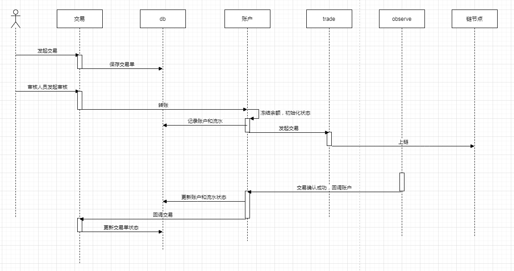
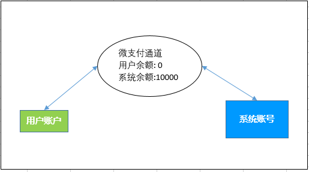
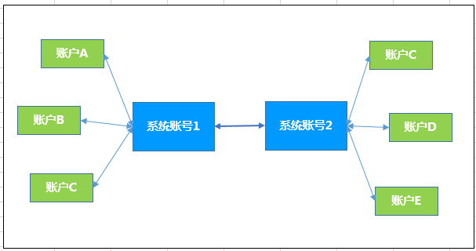
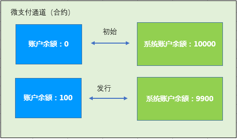

[TOC]

## 1. 引言
本文档主要用于描述区块链账户系统模块中所涉及的服务部署、服务接口组成、主要功能特性、相关性能、安全要求等方面。

### 文档约定

## 2. 背景
以区块链为核心的系统，往往受制于区块链本身的实现方式（交易全球广播，出块速度恒定，需要等待一定数量的后续块），难以实现实时的、高并发的系统设计要求。

一种方案是在区块链与业务系统之间，构建一个账户系统。账户系统实时接收业务请求，异步将数据发送上链。
这种方案完全继承了传统账户系统优缺点外，还多一个与区块链交互，增加了系统的复杂度（如账户系统压力增大时如何保证区块链稳定、与区块链交互异常处理、账户余额与区块链余额的同步等问题）。

> **传统账户系统优缺点**

> 优点：1 高效实时地处理交易；2 开发简单（模型固定、适用性强），运维容易（扩缩容）；

> 缺点：1 复杂的事务处理方式与庞大的对账工作量； 2 复杂的服务与数据容灾架构；

综上，一个好的基于区块链的账户系统需要解决如下3个问题，

1. （准）实时的交易处理；
2. 可扩容；

## 3. 闪电网络
闪电网络的目的是实现安全地进行链下交易，其本质上是使用了哈希时间锁定智能合约来安全地进行0确认交易的一种机制，通过设置巧妙的‘智能合约’，完善链下通道，使得用户可以在闪电网络上进行0确认的交易。

### 3.1 RSMC
全称Recoverable Sequence Maturity Contract，序列到期可撤销合约。其主要原理类似资金池机制。

首先假定交易双方之间存在一个“微支付通道”（资金池）。交易双方先预存一部分资金到“微支付通道”里，初始情况下双方的分配方案等于预存的金额。每次发生交易（不能超过预存金额），需要对交易后产生资金分配结果共同进行确认，同时签字把旧版本的分配方案作废掉。 任何一方需要提现时，可以将他手里双方签署过的交易结果写到区块链网络中，从而被确认。从这个过程中可以看到，只有在提现时候才需要通过区块链。

任何一个版本的方案都需要经过双方的签名认证才合法。任何一方在任何时候都可以提出提现，提现时需要提供一个双方都签名过的资金分配方案（意味着肯定是某次交易后的结果，被双方确认过，但未必是最新的结果）。在一定时间内，如果另外一方拿出证明表明这个方案其实之前被作废了（非最新的交易结果），则资金罚没给质疑方；否则按照提出方的结果进行分配。罚没机制可以确保了没人会故意拿一个旧的交易结果来提现。

另外，即使双方都确认了某次提现，首先提出提现一方的资金到账时间要晚于对方，这就鼓励大家尽量都在链外完成交易。通过RSMC，可以实现大量中间交易发生在链外。

### 3.2 HTLC
Hashed Time Lock Contract，哈希时间锁合约，这个类似限时转账，通过智能合约，双方约定转账方先冻结一笔钱（发送比特币到一个多重签名地址），并由最终接收方生成的一个密码R的哈希值H(R)加锁，如果在一定时间内接收方知晓了密码R，使得它哈希值H(R)跟已知值匹配（实际上意味着转账方授权了接收方来提现），则这笔钱转给接收方。如果约定时间内，接收方未知晓密码R，则转账方可取回已冻结资金。主要由2部分构成：

1. 哈希值锁定，确保了只有知晓最终接收方生成的密码R才可以解锁（即确保最终接收方已经拿到比特币后，中间节点才可以解锁去币，在最终接收方拿到比特币前，中间节点是无法知晓密码R的）。
2. 时间锁定，即确保了转账方在一定时间内（最终接收方解锁取走比特币前）无法取走，又能保证在一段时间后如果最终接收方没有取走比特币的情况下，转账方可以拿回自己的比特币。

举个（闪电网络）例子：A经过B向C转账1个比特币，过程如下：

1. C随机生成一个密码R，计算哈希值H(R)，发给A；
2. A用哈希值H(R)创建和B的HTLC合约：A转1比特币给一个多重签名地址Q，如果B能在2天内知晓密码R，解锁Q，取到A支付的1个比特币；如果2天内，B没有R，2天后Q解锁，A取回自己支付的1个比特币。
3. B用哈希值H(R)创建和C的HTLC合约：B转1比特币给一个多重签名地址，如果C能在1天内知道密码R，则解锁，取到B支付的1个比特币；如果1天内，C无法知晓密码R，1天后解锁，B取回自己支付的1个比特币。
4. 密码R是C生成的，它自然知晓密码R，所以C能在1天内，解锁B的HTLC，取到B支付的1个比特币。在这个过程中，B也看到了密码R。
5. 在C解锁B后，B知晓了密码R，依此B解锁A，取到A支付的1个比特币。
6. 至此，A给了B一个比特币，B给了C一个比特币，等同于A给了C一个比特币，转账完成。

### 3.3 雷电网络
雷电网络是以太坊的链下的扩展方案， 可以实现近乎即时的、低交易费、可扩展的支付方式。它是以太坊的扩展， 可以用来传输满足erc20标准的token。雷电网络绕过了区块链的共识。采用的方式是在利用链下的支付通道网络。

**特性**：

1. **可扩展**: 参与者的数量成线性比例
2. **快速**:传输可以在一秒内进行确认
3. **私密**:个人转账不会显示在全球分类帐中
4. **可互操作**:符合Ethereum标准化标记API（ERC20）之后的任何令牌
5. **低费用**:转移费可能比区块链低一个数量级
6. **小额支付**:低交易费允许有效地转移微小的价值

**用途**：零售支付、P2P现金、小额支付

### 3.4 闪电网络是否支持大额交易？
是可以的。

制约大额交易主要有如下两点：

1. 支付通道需要预存保证金，除了点对点外，交易额度取决于路径上最少可用资金的节点。因此，对于较大额的支付，可能很难甚至不可能找到支付路线。
3. 交易路径需要被中间节点识别，中间节点不同意，则交易失败。

综上，并非闪电网络本身限制了大额交易，而是当前参与者生态还未成熟。

## 4 账户系统
当前区块链账户系统交互设计图，如下。

可以看到，整体以账户系统为中心构建，所有请求都由账户系统接收处理，然后发送给区块链，异步获取区块链的结果。

1. 账户系统记录账户余额与流水；记录成功异步发送上链；
2. 区块链记录ERC20 token余额，通过交易变更余额。

### 4.1 引入闪电网络
引入闪电网络后，区块链余额的记录将会有重大变化。余额直接记录在微支付通道中，ERC20余额只有“提取到区块链”才真正触发交易和记录。

> “提取到区块链”的场景，类似于跨行转出（或从财付通余额转出到银行），也就是需要流通的场景，短期内INF没有这个需求。而且中心化托管系统无论是否提取，都是后台系统操作，本身没有区别，也没有必要。所以，正常情况下，ERC20不再有余额，全部存放微支付通道。只在流通场景需要上链。

另外，基于上述对闪电网络大额交易的讨论，在私链-中心化托管系统里，没有了资金和流通性的限制，那么大额也可以通过闪电网络交易。这样，除了“提取”外的其他交易其他交易都可以通过闪电网络实时完成。

引入闪电网络后的系统交互图，如下：

与上面方式相比，有如下几个变化：

1. 区块链由原来单独ERC20合约，变为加入RSMC、HTLC构建账户闪电网络；
2. 基于闪电网络，交易将实时完成；只有“提取到区块链”才会上链；
3. 账户系统将会变轻，余额将不再是重点关注字段，而会变为一种类似缓存的存在。真正余额可以依赖区块链存储的数据。
4. 绝大部分交易不再直接上链，释放了区块链网络资源。

#### 4.1.1 闪电网络构建
每个用户开户时即开通和系统账户之间的微支付通道（合约），创建后微支付通道中系统账户预分配一个足够大的数10000000000，用户余额为0。

所有用户开通微支付通道，形成如下星型结构关系（图中展示的是多系统账户的情形）

#### 4.1.2 发行和转账
发行和转账，都都是修改RSMC合约分配方案。

发行示意图：

转账示意图，A账户转账B：

#### 4.1.3 提取到区块链
调用ERC20合约，记录用户余额，将微支付通道余额还原以备后续使用。

#### 4.1.3 初始化系统账户金额
初始化微支付通道的系统账户金额，可以看做一个系统赋予用户的一个账户额度，不参与任何总分账户计算（核对）。

初始化系统账户金额的出处？
1. 如果微支付通道合约可以无中生有，则直接赋予系统账户金额；
2. 否则，先初始化ERC20系统账户余额，然后转移到微支付通道；

### 4.2 扩展性与安全性
(待补充)
