[TOC]

## 1. 引言
本文档主要用于描述区块链账户系统模块中所涉及的服务部署、服务接口组成、主要功能特性、相关性能、安全要求等方面。

### 文档约定

## 2. 背景
在此前的账户系统优化设计中，主要讨论了基于闪电网络思路的创新方案，该方案旨在解决当前系统tps不足的问题，对适用场景、横向对比、扩展性和安全性的讨论较少。
本次将对此前方案进行细化和补充，并且将展开探讨状态通道和侧链结合账户系统的可能性与优劣对比。

## 3. 当前中台的模式
**当前中台的主要特点如下**：

1. 中台与区块链各自独立；
2. 中台实时接收业务请求，同步/异步将数据发送上链；
3. 每一笔交易与区块链交互一次；
4. **完全托管公私钥在中台**；

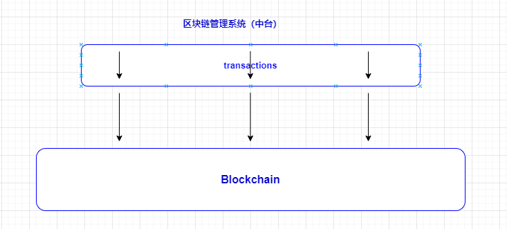

**中台模式的缺点**：

1. 受限于区块链的机制，tps不高并且无法扩展；
2. 完全托管的资产，却需要每笔交易上链，耗费过多的交易费；
3. 基于第二点的现状，交易确认时效低；
4. 中台数据与区块链数据需要核对机制；

**适用场景**：托管式中心化交易所；基于私链的中心化信息/资产管理系统；

**改进/优化点**：公私钥全托管的情况下，无需每笔交易上链，账户和流水记录在db里即可，只在需要提取/流通的场景才上链。这样与区块链的交互大大减少，非提取操作将在中台实时完成。

**优化后，能够提高系统整体健壮性和可扩展性，同时节约了交易费用。在当前使用场景下，已经能够达到“闪电网络优化方案”期望的目标了**。

## 4 中台模式的演进
根据上一章节的描述，在当前场景下，中台（稍作优化后）能够满足健壮性与可扩展性要求。

现在假设一个非托管的场景，用户自己持有账户公私钥，示意图如下：

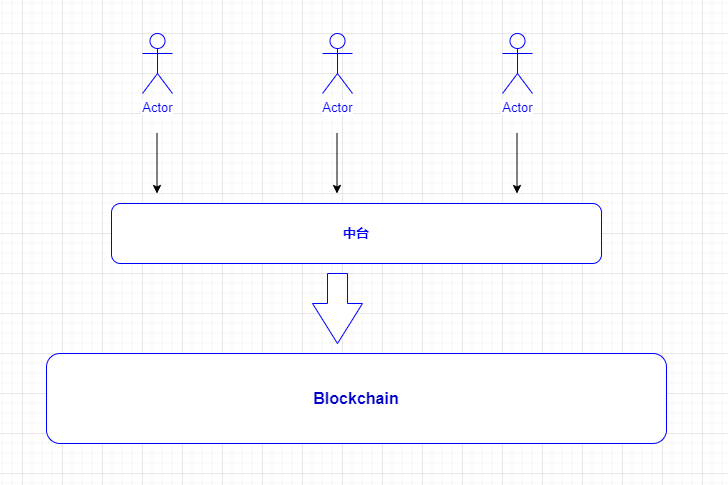

|名称|描述|
|-|-|
|用户|c端用户，持有公私钥，任何交易都需要由用户发起并签署|
|中台|作为链的服务渠道（类似商业银行/机构），面向c端用户接收交易请求，验证用户签署的交易|

主要流程：

1. **注册**：用户持有公私钥，注册中台账户时仅生成账户id，不生成公私钥和地址；
2. **充值**：用户可以把ta持有的INF转入中台，或者直接在中台购买INF；
3. **转账**：中台内部账户间转账，或者转账给非中台地址；
4. **提现**：将中台账户余额提出到链上；

这种应用场景下，中台直接面对c端用户，不仅要求能够承受极高的并发与tps，同时要求能够确保资产安全。这两项也是之前的“闪电网络优化方案”提出的初衷，下面详细讨论方案的具体实现细节。

### 一种用来记账的多签合约
在“闪电网络优化方案”中，借用了微支付通道的概念来处理用户记账和转账，如下

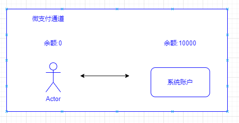

为了能够处理用户任意大小的交易余额，需要在通道中预设一个足够大的系统账户余额，以支持用户与系统账号之间的金额转移，并且作为用户与用户资金转移的桥梁。这种方式生硬的套用微支付通道做法，是不够好的。

本质上只需要一个用户和系统2/2多签序列化合约，即可实现用户记账和转账的功能。如同RSMC一样，可以通过不断更新合约来修改用户金额，以最后一个版本提交上链。

**合约更新**：合约中用户余额减少，都需要用户与系统账号多签予以确认，用户余额增加，可以由系统操作。

**INF锁定**：用户可以将INF发送到合约里，合约将锁定此INF，作为中台渠道的账户余额，通过中台进行交易。

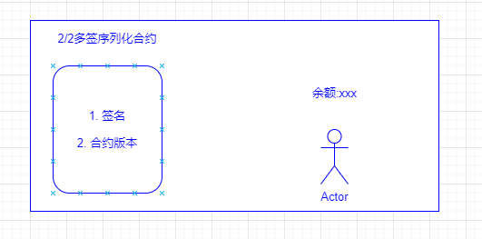

> toC的这个场景已经类似于CBDC了，所以这里不考虑中台作恶将过期合约发送上链的可能。还有一种思路，设计一个合约，只有多签成功才能发送上链，将主动权完全赋予用户。

### 4.1 注册
用户注册时，共同订立一份2/2多签序列化合约合约存放链上，作为用户开户依据。同时在中台为用户开立中台账户，记录用户信息。

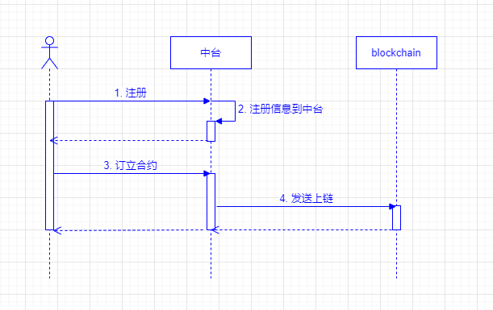

### 4.2 充值
充值过程是通过更新以上多签合约来实现的。

充值分为两种情况，

1. 用户已持有INF，充值时从链上转移到中台（合约）。此时的合约无需多签，但会锁定用户INF金额。
2. 用户从中台购买INF，此时只更新合约版本并2/2签名，无需实时更新合约。

#### 4.2.1 从链上转移INF到中台
用户从链上转移INF到中台，直接在链上操作将INF锁定到合约即可。

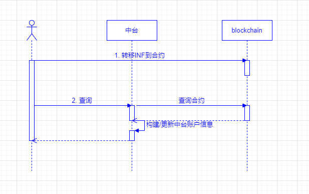

#### 4.2.2 从中台购买INF

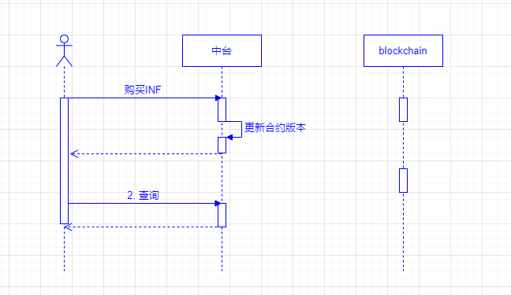

### 4.3 提现
提现，用户将INF提出中台渠道，中台将合约最终版本发送上链，解锁用户的余额。

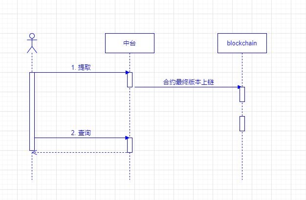

### 4.4 转账
与充值一样，转账也通过更新合约来实现，分为两种情况：

1. 交易双方都是中台渠道用户，则更新交易双方的合约，发起方需多签，接收方由系统操作；
2. 交易接收方不是中台渠道用户，发起方余额减少后，中台发起系统提现给接收方链上账户增加余额；

### 4.5 合约与ERC20合约的关系

1. 用户余额分两部分，一部分是链上ERC20合约里的余额；另一部分在中台，即在我们合约里；
2. 用户余额从ERC20流向合约时（即上面充值的第一个场景），与正常转账一样，收款方是多签合约地址；
3. 用户余额从合约流向ERC20时（即提现场景），合约调ERC20合约；

### 4.6 与当前方式的对比

||当前中台|演进优化方案|
|-|-|-|
|支持并发和tps|高|高|
|是否可扩展|是|是|
|托管|公私钥完全托管在中台|公私钥有用户持有|
|中台存储的数据|账户公私钥、地址，账户余额、交易流水|合约的更新凭证、账户流水|
|中台职责|全权处理用户交易，上链|与用户共同签署合约并保留凭证，上链|
|信任度|低|中高|
|应用场景|托管中心化交易所，基于私链的中心化信息/资产管理系统；|CBDC，币管理系统，基于区块链的资产管理系统|

## 5 安全与扩展性
**安全性**：以上两版中台方案，都有重要数据存储在传统数据库（mysql）里，要由中台来保证数据安全性。数据库部署需使用主从或三园区部署架构。

**扩展性**：以上两版的中台方案，都可以通过中台的平行扩容增加系统容量

## 6. 区块链扩容之状态通道和侧链

先看看有哪些方案可以用来提升区块链系统的可扩展性

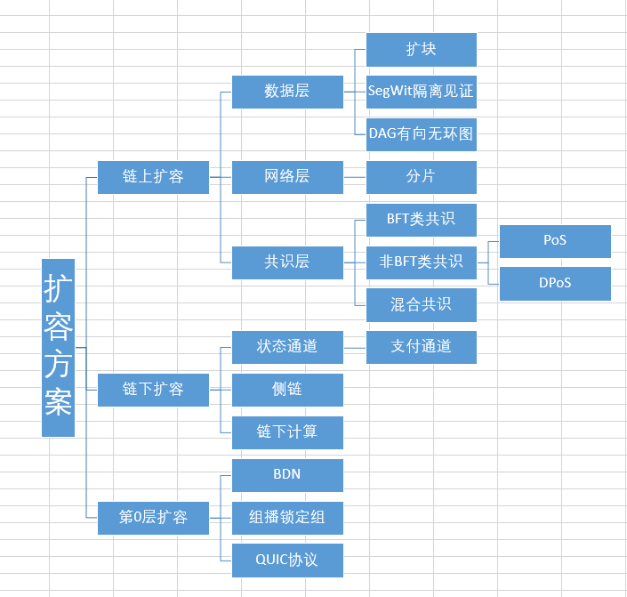

### 状态通道

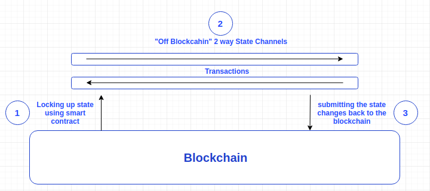

支付通道是当今最广泛采用的layer2协议之一。闪电网络（Lightning Network）就基于支付通道。

支付通道是状态通道的特定实现。状态通道是在一组固定的参与者（通常是两个）之间进行安全线下交易（transact）的协议。对于支付通道来说，这种线下交易就表现为资产的交换。

支付通道协议如下运作：两方先在主链上存入一些资产，例如10美金的比特币。这表现为两笔线上交易。这之后，只要双方保持非负的资产，就可以即时互相发送资产，而无需主链的参与。这是通过互相之间发送状态更新消息，格式类似于：【交互编号，金额，签名】。

一旦某一方想要终止支付通道。他们可以执行一个称为“exit”的操作：提交最后的状态更新到主链上，并将各方最后的余额各自发回。主链可以通过签名验证状态更新的有效性以及最后的余额是否正确。这样就能确保支付通道无法从一个无效的状态退出（exit）。

应用场景

1. 小额支付
2. 游戏

状态通道面临的主要问题包括

1. 路由问题
2. 通道平衡问题
3. 节点离线问题
4. 保证金锁定问题
5. 退出等待问题

> 通过设计合理的路由策略可以将状态通道扩展为网络结构，目前的方案有哈希时间锁合约、虚拟通道和元通道。通道平衡问题的主要解决思路有背压路由算法和链下重新平衡方案。节点离线问题的主要解决思路是引入第三方来监督链下状态，并加以经济激励(WatchTowers)。保证金锁定问题的解决思路是从流动性资金供应商那里吸收闲散资金、共享资金池。

### 侧链

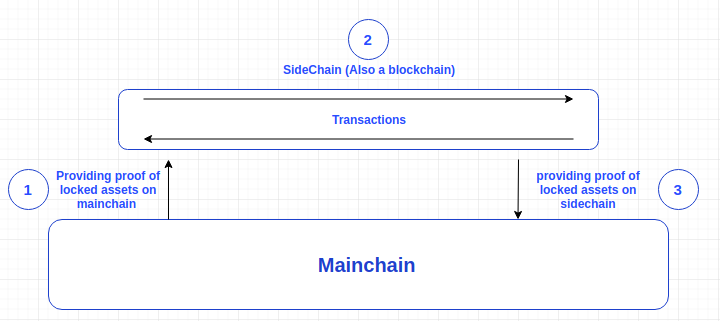

侧链是主链（如比特币、以太坊）节点联盟之间的私有区块链。由于它基于一个较小的网络，侧链允许更快、更安全的事务。

侧链一般会选择效率更高的共识算法，比如PBFT/PoS/DPoS等。根据不可能三角法则，在可扩展性提高的同时，去中心化和安全性必然会出现一定程度的削弱。

侧链面临的两个主要问题

1. **侧链分叉问题** : TODO 可以选择将自己的块头快照到主链上以避免自己的分叉。
2. **无效状态转移** : 尽管侧链确实可以借助主链的安全性防止分叉，侧链的验证者还是能够串谋发起另一种形式的攻击，称作“无效状态转移”。这种攻击的思想是，主链不可能验证侧链的所有区块（否则就失去了侧链存在的本意了）。因此如果超过50%或66%的验证者串谋（百分比根据具体侧链设计决定），他们可以创建一个完全无效的区块，偷取其他人在侧链上的资产，并把该区块快照到主链上。这个无效区块发起了一个对那些偷来的资产的退出，并由此完成了偷取的过程。

有些文章也提到了一些解决无效状态转移的方法，但是在现实中都还未实现。目前绝大多数侧链都基于一个前提假设，就是不会有超过50%（或66%，基于设计）的验证者出问题。

### 扩容方案的总结和思考
无论是状态通道、侧链还是链下计算，都是对主链扩展性的补充，是围绕主链生态的一部分。

在探索中台与扩容方案过程中的思考

1. **中心化中台与扩容方案**：中台作为业务系统，区块链是中台系统的基础设施，中台借助区块链分布式、去中心化等特性完成信息流资金流的传递，中心化中台可以为区块链提供足够的可扩展性。区块链扩容方案--状态通道、侧链等，作为链（一般指主链）的生态，是一种更全局宏大的扩容方案，目前在区块链社区和实验室探索。扩容方案的目标与实施难度与中心化中台都不在一个层面上，用来解决中台的问题，大材小用了~~
2. **私链与扩容方案**：扩容方案诞生于公链，伴随公链发展，私链没有动力、没有需求应用扩容方案。如果未来扩容方案发展成熟，作为区块链插件式的底层设施，打包一起作为解决方案，那时私链的扩容方案才会迎来发展。
3. **扩容方案的启发**：扩容方案在思想上有非常好的方向，虽然上面的演进方案用的是合约实现，但是思路起点是闪电网络。