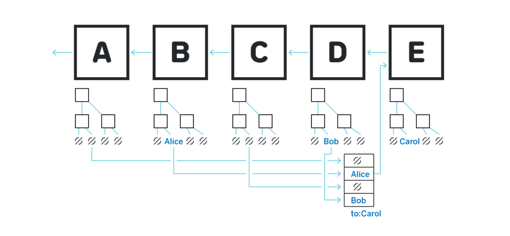
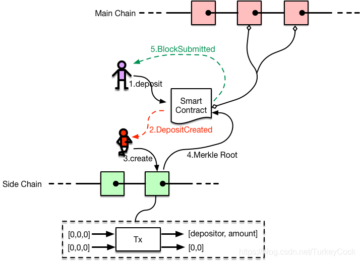
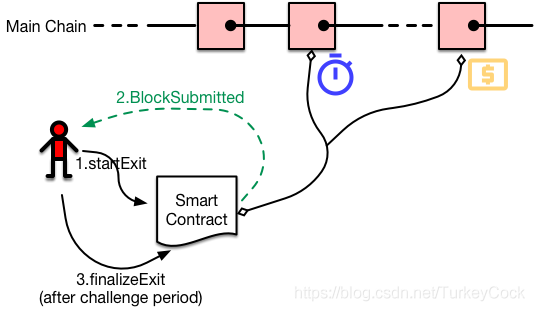
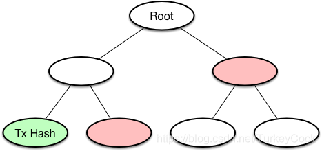
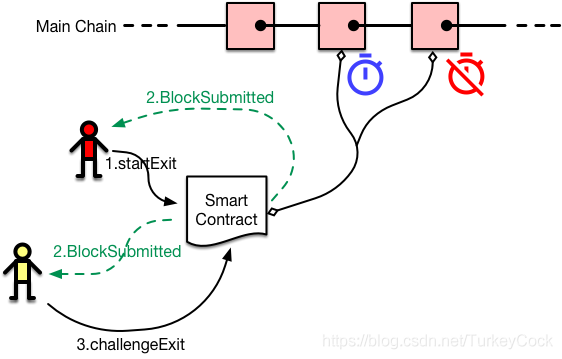
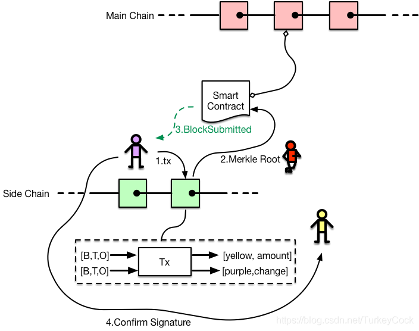

## 背景

## layer2

Layer2技术基于以下假设：并非每个人都需要知道网络上发生的每一笔交易。事实上，主链只需要记录交易的最终结果，交易的过程可以在更高效更经济的交易环境中完成。

Layer2技术主要包括如下3种
1. 状态通道，闪电网络、雷电网络、 celer network
2. 侧链，blockstream的liquid network，plasma，
3. 链下计算


## 状态通道（State Channels）

支付通道是当今最广泛采用的layer2协议之一。闪电网络（Lightning Network）就基于支付通道。

支付通道是状态通道的特定实现。状态通道是在一组固定的参与者（通常是两个）之间进行安全线下交易（transact）的协议。对于支付通道来说，这种线下交易就表现为资产的交换。

支付通道协议如下运作：两方先在主链上存入一些资产，例如10美金的比特币。这表现为两笔线上交易。这之后，只要双方保持非负的资产，就可以即时互相发送资产，而无需主链的参与。这是通过互相之间发送状态更新消息，格式类似于：【交互编号，金额，签名】。

一旦某一方想要终止支付通道。他们可以执行一个称为“exit”的操作：提交最后的状态更新到主链上，并将各方最后的余额各自发回。主链可以通过签名验证状态更新的有效性以及最后的余额是否正确。这样就能确保支付通道无法从一个无效的状态退出（exit）。

应用场景
1. 小额支付
2. 游戏

状态通道面临的主要问题包括
1. 路由问题
2. 通道平衡问题
3. 节点离线问题
4. 保证金锁定问题
5. 退出等待问题

> 通过设计合理的路由策略可以将状态通道扩展为网络结构，目前的方案有哈希时间锁合约、虚拟通道和元通道。通道平衡问题的主要解决思路有背压路由算法和链下重新平衡方案。节点离线问题的主要解决思路是引入第三方来监督链下状态，并加以经济激励(WatchTowers)。保证金锁定问题的解决思路是从流动性资金供应商那里吸收闲散资金、共享资金池。


具体到闪电网络，还有如下3点问题

1. 闪电网络协议中存在一些漏洞可能会降低流动性，或与改善流动性的愿景相悖。
2. 闪电网络对支付通道的依赖使其可能遭受拥塞攻击，攻击者会长时间锁定其他节点的通道容量。
3. 只包含少量中间节点的闪电支付可能容易受到这些节点的流量分析攻击。在此类攻击中，中间节点从交易参与者的支付模式中学习可能的解匿名信息。用户可以通过有意选择更长的支付路径来克服这一弱点，但这会导致费用和复杂性的略微增加。


## 侧链
侧链是主链（如比特币、以太坊）节点联盟之间的私有区块链。由于它基于一个较小的网络，侧链允许更快、更安全的事务。

侧链一般会选择效率更高的共识算法，比如PBFT/PoS/DPoS等。根据不可能三角法则，在可扩展性提高的同时，去中心化和安全性必然会出现一定程度的削弱。

侧链面临的两个主要问题

1. **侧链分叉问题** : TODO 可以选择将自己的块头快照到主链上以避免自己的分叉。
2. **无效状态转移** : 尽管侧链确实可以借助主链的安全性防止分叉，侧链的验证者还是能够串谋发起另一种形式的攻击，称作“无效状态转移”。这种攻击的思想是，主链不可能验证侧链的所有区块（否则就失去了侧链存在的本意了）。因此如果超过50%或66%的验证者串谋（百分比根据具体侧链设计决定），他们可以创建一个完全无效的区块，偷取其他人在侧链上的资产，并把该区块快照到主链上。这个无效区块发起了一个对那些偷来的资产的退出，并由此完成了偷取的过程。

上面链接的文章也提到了一些解决无效状态转移的方法，但是在现实中都还未实现。目前绝大多数侧链都基于一个前提假设，就是不会有超过50%（或66%，基于设计）的验证者出问题。


### 等离子链（Plasma）
Plasma是Vitalik和Joseph Poon提出的区块链扩容技术方案，一经提出便受到区块链业内瞩目。有望将以太坊的性能提升至超越EOS的水平。

等离子链（Plasma）是一种支持“无托管”（non-custodial）思想的侧链设计。也就是说，即使所有侧链（叫做等离子链）验证者都串谋进行有害的行为，离子链上的资产还是安全的，也可以安全的退回主链。



为了实现以上目标，Plasma框架包含以下三个主要组成部分：

1. 链下执行：即在主链之外执行交易
2. 状态提交：侧链状态的压缩版本（即交易的Merkle根），需要提交到主链上
3. 退出机制：用户通过提供凭证（Merkle proof），可以随时、安全地退出侧链


总之，等离子链最大的优点就是其上代币的安全性。一个诚实用户可以确信能取出自己的代币，无论下列哪种情况发生：等离子链操作者创建一个无效状态转移（在诚实用户获得代币之前或之后都可以），等离子链操作者扣押区块，甚至完全不生成区块。在所有这些场景中，或者简单说，在任何场景下，代币不会丢失。

缺点是在转账代币时，必须提供完整的代币历史，以及其退出机制的复杂性（对这些机制的推导）。


### plasma mvp
MVP即Minimal Viable Plasma，是Plasma的一个最小实现版本。

Plasma MVP基于UTXO模型，只支持转账，不支持脚本或智能合约的执行。侧链共识机制采用POA（Proof-of-Authority），依赖一个被称为operator的节点生产侧链区块，然后把侧链状态提交到主链上。用户首先通过主链的智能合约充值，之后就可以完全在侧链上交易了，如果想要提现或者侧链出现安全性问题，用户可以向主链智能合约发起退出申请。

#### 充值（Deposit）
目前只支持ETH充值，后续会支持ERC20代币。



首先用户（紫色）向主链智能合约发起一个deposit调用，交易执行后会产生一个DepositCreated的event。Operator（红色）监测到这个event后，创建一个只包含一笔交易的区块，为用户创建侧链资产。侧链上的交易由两个输入UTXO和两个输出UTXO组成，在充值情况下，只有第一个输出有值，其他都为0。

随后，operator把该区块的Merkle根提交到主链智能合约，合约会发送BlockSubmitted的event。用户可以监听到这个event，并验证其有效性。

#### 退出（exit）
如果用户想要把侧链资产重新转回主链，则需要启动退出流程。



用户（红色）向主链智能合约发起一个startExit调用，同时提供一笔保证金（EXIT_BOND）。

合约会把该请求放入一个优先队列中，优先级等于区块高度 * 1000000000 + 区块中交易index * 10000 + 交易中UTXO的index。这样设计的目的是保证出现非法交易时，之前的所有合法UTXO都可以安全退出。

退出请求需要等待一段时间才能生效，可以理解为“公示”。等待时间长度等于Max(UTXO创建时间+2 weeks，当前区块时间+1 week)，也就是说，最快7天、最慢14天可以完成提现操作。

最后，当等待期结束后，用户可以向主链智能合约发起一个finalizeExit调用，把资金连同EXIT_BOND真正转入主链账号中。


那么发起退出调用需要提供哪些材料呢？我们看一下startExit()的函数原型：
````
function startExit(
        uint256 _utxoPos,
        bytes _txBytes,
        bytes _proof,
        bytes _sigs
    )
````

1. _utxoPos：UTXO的具体位置，以“blknum * 1000000000 + txIndex * 10000 + oIndex”的形式传递进来
2. _txBytes：UTXO对应的原始交易数据(RLP编码)，用于和merkle proof一起验证该交易是否存在于区块中
3. _proof：即merkle proof，算出原始交易的哈希值后，可以通过merkle proof算出区块的Merkle根，验证该笔交易的合法性
4. _sigs：包含两个签名：交易签名和确认签名，用于确认用户是否有权提取该UTXO（确认签名后面会讲到)


关于merkle proof，不熟悉的同学可以看下面这张图，如果我想确认左下角绿色的交易是否存在于区块中，只需要提供两个红色的哈希值作为merkle proof就可以了：



#### 挑战退出（challengeExit）
如果用户发现，有人给他转了一笔钱，但是又发起了退出申请想把这笔钱提走，那就必须阻止他，这被称为challengeExit。



之前提到，提现会有7～14天的等待期，就是为了让用户有足够的时间发起挑战。如果挑战成功，则把退出请求从优先队列中删除，同时把EXIT_BOND作为奖励转给发起挑战的用户。挑战退出需要提供的材料参见以下函数原型：
````
function challengeExit(
        uint256 _cUtxoPos,
        uint256 _eUtxoIndex,
        bytes _txBytes,
        bytes _proof,
        bytes _sigs,
        bytes _confirmationSig
    )
````

其中_cUtxoPos代表发起挑战的UTXO的位置，_eUtxoIndex代表被挑战的UTXO是交易中的第几个输入。


#### 抵御“扣块攻击”
“扣块攻击“，即Block Withholding Attack，指的是operator生成区块后不广播给其他用户，同时把该区块的Merkle根提交到主链上。这样就造成了信息不对称：如果operator先伪造一笔交易把UTXO转给自己，然后把你消费这笔UTXO的交易放在后面，一起打包进区块（不广播）。在这之后，operator向主链申请提现，用户无法对他发起挑战，因为无法提供需要的材料。当然，用户也可以向主链申请提现这笔UTXO，但是operator可以出示被扣留块中你的交易签名，对你发起挑战，导致你提现失败。

为了抵御这种攻击，MVP增加了一个确认签名（Confirmation Signature）的设计：



举个例子：用户A（紫色）在侧链上给用户B（黄色）发了一笔转账交易，此时他会对该交易进行签名。只有当用户A确认该笔交易已经被包含在一个合法区块中（即他收到了这个块），并且operator也已经把Merkle根提交到主链上了以后，才会给用户B发送一个确认签名。之前提到过，用户发起退出申请时必须提供确认签名信息，所以如果发生扣块攻击，operator将无法得到用户的确认签名，也就无法成功提现。

## Roll Up二层方案