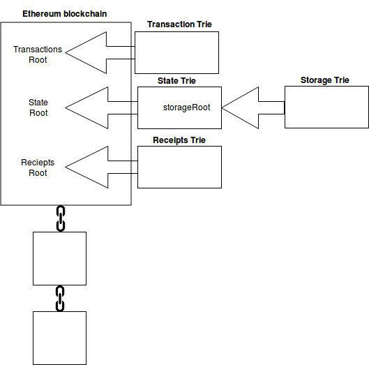

## 以太坊世界状态
管理账户余额

## Merkle Patricia Tree（MPT）树

MPT树的作用
1. 存储任意长度的key-value键值对数据；
2. 提供了一种快速计算所维护数据集哈希标识的机制；
3. 提供了快速状态回滚的机制；
4. 提供了一种称为默克尔证明的证明方法，进行轻节点的扩展，实现简单支付验证；


### trie 树
前缀树（又称字典树），用于保存关联数组，其键（key）的内容通常为字符串。前缀树节点在树中的位置是由其键的内容所决定的，即前缀树的key值被编码在根节点到该节点的路径中。


### Merkle 树
merkle树是自底向上构建的。在下图的例子中，首先将L1-L4四个单元数据哈希化，然后将哈希值存储至相应的叶子节点

将相邻两个节点的哈希值合并成一个字符串，然后计算这个字符串的哈希，得到的就是这两个节点的父节点的哈希值。

重要结论：
**若两棵树的根哈希一致，则这两棵树的结构、节点的内容必然相同**


### 三种节点类型
知道了Merkle Tree，知道了Patricia Tree，MPT（Merkle Patricia Tree）就是这两者混合后的产物。下面我们介绍一下MPT树的三种节点类型：

1. 分支结点（branch node）：包含16个分支，以及1个value
2. 扩展结点（extension node）：只有1个子结点
3. 叶子结点（leaf node）：没有子结点，包含一个value


需要注意的是：**Key-value 这里的value存储的是key，key存储在路径上**

详细解释
````
1. 叶子节点，表示为[key,value]的一个键值对，其中key是key的一种特殊十六进制编码
2. 扩展节点，也是[key，value]的一个键值对，但是这里的value是其他节点的hash值，这个hash可以被用来查询数据库中的节点。也就是说通过hash链接到其他节点。
3. 分支节点，因为MPT树中的key被编码成一种特殊的16进制的表示，再加上最后的value，所以分支节点是一个长度为17的list，前16个元素对应着key中的16个可能的十六进制字符，如果有一个[key,value]对在这个分支节点终止，最后一个元素代表一个值，即分支节点既可以搜索路径的终止也可以是路径的中间节点。
4. 叶子节点和扩展节点是新增加的！（对比于前缀树来说）
````

### MPT中的Merkle
**即指向下一级节点的指针是使用 节点的确定性加密hash，而不是传统意义上下一级节点地址的指针**

如果给定的trie的根哈希是公开的，则任何人都可以 通过给出给定path上的所有节点, 来证明在给定path上存在一个给定值 ，对于攻击者,不可能提供一个不存在的（key，value）对的证明, 因为根哈希最终基于它下面的所有哈希，所以任何修改都会改变根哈希。


### HP编码
HP-编码：特殊的十六进制前缀编码
引入：对nibble和节点奇偶性进行编码

````
Nibble是什么？
引进一种特殊的终止符标识来标识key所对应的是值是真实的值，还是其他节点的hash。如果终止符标记被打开，那么key对应的是叶节点，对应的值是真实的value。如果终止符标记被关闭，那么值就是用于在数据块中查询对应的节点的hash。
为什么需要对节点奇偶性进行编码？
数据最小的表示单位为一位16进制，如1、a等，但在编程实现中，数据的最小表示单位往往是byte（8bit，2位16进制数），这样在用byte来表示一串奇数长度的16进制串时会出现问题。
例如"5b3"和"5b30"，直接转成byte都是5b30。
````

举例:

对"0x5b3ed"编码（奇数位）

"0x5b3ed" = "0005 1011 0003 1110 1101"t=0 时, "0001"+"0005 1011 0003 1110 1101"->"00010005 10110003 11101101"->"0x15b3ed"
t !=0时 "0011"+"0005 1011 0003 1110 1101"->"00110005 10110003 11101101"->"0x35b3ed“

对"0x5b3e"编码（偶数位）

"0x5b3e" = "0005 1011 0003 1110"t=0 时, "0000"+"0005 1011 0003 1110 1101"->"00000005 10110003 11101101"->"0x005b3e"
t !=0时 "0010"+"0005 1011 0003 1110 1101"->"00100005 10110003 11101101"->"0x205b3e"


1. 这里的t就是是否结束的标志位
2. 最低位表示奇偶性，第二低位编码终止符状态。
3. 最低位为0的时候表示偶数位置，反之奇数。
4. 第二低位为1的时候表示结束，反之不结束。

官方表示形式


这里的prefix就是HP编码！对终止符的状态和奇偶性进行编码。最低位表示奇偶性，第二低位编码终止符状态。
总共有2个扩展节点，2个分支节点，4个叶子节点。 右边是叶子节点的情况，左边代表的是节点的prefix（HP编码）
这就是一个状态树的存储形式，其实他应当长的样子，我们可以细细想一下，他的key被编码成一种特殊的16进制的表示，value是一些rlp后的数据，而且比上图要大的多的多。

### 相关MPT树
现在，我们来回看一下，状态、存储以及交易树使用的MPT树。

首先说，全局状态树，这个全局状态树包含了以太坊网络中每一个账户的一组键值对。

对全局状态树的几点说明：
1. 状态前缀树包含了以太坊网络中每一个账户的一组键值对。
2. 他的Key是一个 160 位的标识符（以太坊账户的地址）。
3. 全局状态树中的 “值” 是通过编码以太坊账户中的如下细节来得到的（使用RLP的方法）：
   + nonce
   + 余额
   + 存储前缀树根节点hash
   + 代码hash


存储树是智能合约数据存储的位置，每一个以太坊账户都有自己的存储树。


## 区块与存储
账户余额这样的数据并不直接保存在以太坊区块链的区块中。区块中只保存交易树、状态树和收据树的根节点哈希值。



从上图中可以注意到，存储树（所有智能合约数据存储的位置）的根节点哈希实际上指向了状态树，从而间接指向了区块链。

以太坊中存在两种截然不同的数据类型：永久数据和暂存数据。交易就是永久数据的一个例子。一旦一个交易被确认，它就将永久地被记录在交易树结构中，并且无法篡改。而某一个特定以太坊账户的余额则是暂存数据的例子。账户地址的余额存储在状态树中，并且每当接收到和该账户有关的交易时，该余额都会改变。将挖矿确认后的交易这样的永久数据和账户余额这样的暂存数据分开管理是有意义的。以太坊使用前缀树这种数据结构（上图所示结构）来管理数据，那么接下来我们介绍一下什么是前缀树。


### state trie 状态前缀树 -- 独一无二
以太坊中有且只有一个全局状态前缀树。

这个全局状态树在不断地更新着。

这个状态前缀树包含了以太坊网络中每一个账户的一组键值对。

这个 “键” 是一个 160 位的标识符（以太坊账户的地址）。


全局状态前缀树中的 “值” 是通过编码以太坊账户中的如下细节来得到的（使用递归长度前缀编码 （RLP） 的方法）：
1. nonce 值
2. 余额
3. 存储前缀树根节点哈希
4. 代码哈希


状态前缀树的根节点（在给定时间点整个状态树的哈希值）是用来确保状态前缀树安全的唯一标志符，状态前缀树的根节点是由整个内部状态树的全部数据来通过密码学手段得到的。


-状态前缀树（用 leveldb 实现的默克尔帕特里夏树（缩写 MPT））和一个以太坊区块之间的关系-


### storage trie 存储前缀树 -- 智能合约数据的存储
存储前缀树是智能合约数据存储的位置。每一个以太坊账户都有自己的存储前缀树。在全局状态前缀树中保存着存储前缀树根节点的 256 位哈希 storageRoot 值


### transaction trie 交易前缀树 -- 一个区块一个树

每一个以太坊区块都有着自己的独立的交易前缀树。一个区块往往包括多笔交易，而交易的顺序当然由打包交易的矿工来决定。在交易前缀树中找到一笔交易的路径是通过（RLP 编码方法）检索交易在区块中的索引来得到的。已经被挖矿验证过的区块将永远不会再更新，所以区块中的交易顺序也将固定下来。这就意味着一旦你从区块的交易前缀树中定位到了某一笔交易，你日后就可以通过相同的路径找回它。


